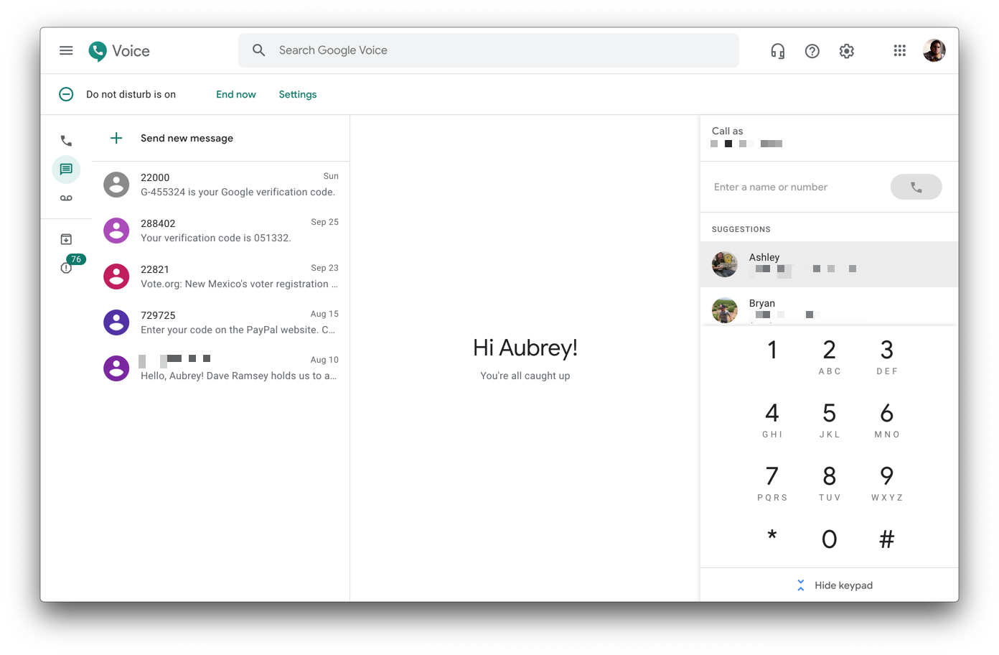

# Google Voice



An (unofficial) native MacOS App for Google Voice.

## Install

Download the `.dmg` from the [releases](releases) section and install per normal or, 

## Install via [Homebrew](https://brew.sh)

```bash
brew tap aubreypwd/homebrew-cask
brew update
brew install google-voice
```

### Upgrade

```bash
brew update
brew upgrade google-voice
```

_Note, you must right-click the app to open, even after upgrading._

----

## Development

1. Clone repo
2. `npm install`
3. `npm run build`

`npm run build` will built the application to `build/` and  `npm run dist` to generate a `.dmg` in `dist/` for distribution and installation.

